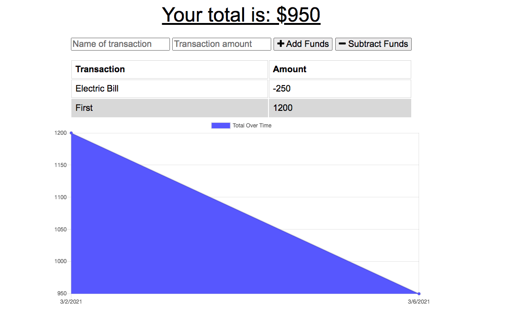

# Budget-Tracker

In this app, I will be displaying a budget tracker app that anyone can use to manage their expenses. A user will be able to subtract and add money for everyday expenses or to budget a trip or manage bills.

# Technologies 
 
 The technology that was used in this app were HTML, CSS, JS, MongoDB, Express, and Node.

# Screenshots

Enjoy the App!